# Waverless Architecture

Waverless is a **Serverless GPU task scheduling system** providing RunPod API-compatible worker management, task distribution, autoscaling, and graceful shutdown.

## Core Features

- ✅ **RunPod Compatible API** - Zero-code migration from runpod SDK
- ✅ **Autoscaling** - Queue-depth and resource-aware scaling with priority
- ✅ **Graceful Shutdown** - Zero task loss during rolling updates
- ✅ **Multi-tenant** - Isolated endpoints with independent configurations
- ✅ **High Availability** - Multi-replica deployment with distributed locking

---

## System Architecture

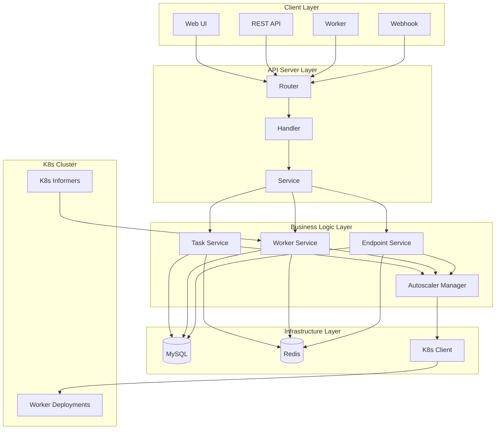

---

## Core Components

### 1. Task Service

**Responsibilities**: Task lifecycle management

- Task creation and status management
- Task assignment and scheduling
- Task timeout detection
- Orphaned task cleanup

**Data Flow**:
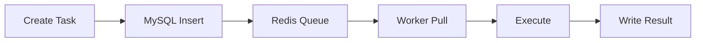

### 2. Worker Service

**Responsibilities**: Worker registration, heartbeat, task assignment

- Worker registration and status management
- Heartbeat detection and offline cleanup
- Task assignment with Double-Check pattern
- DRAINING status management

**Worker State Machine**:
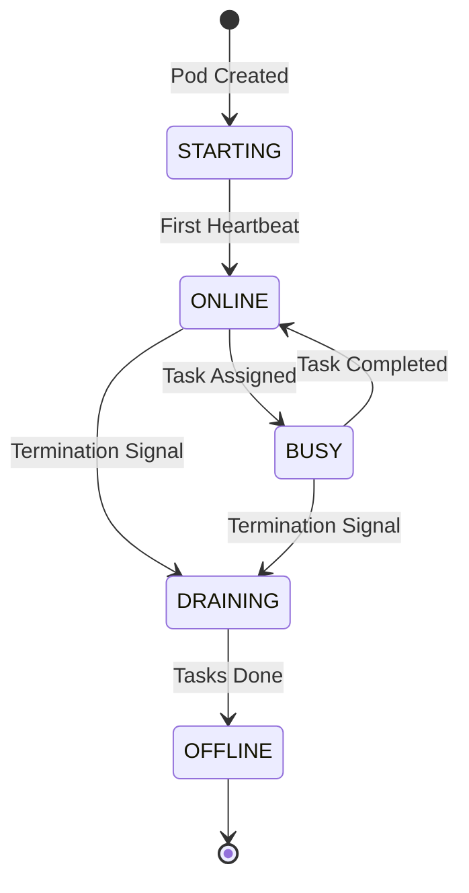

### 3. Endpoint Service

**Responsibilities**: Multi-tenant management

- Endpoint metadata management
- Autoscaling configuration per endpoint
- Statistics aggregation

### 4. Autoscaler

**Responsibilities**: Intelligent scaling decisions

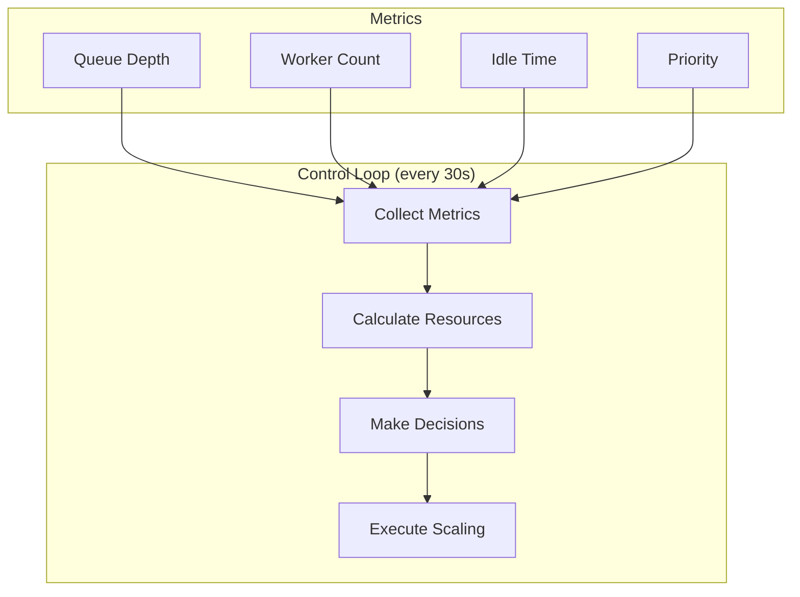

**Decision Algorithm**:
1. **Scale up**: `pendingTasks >= scaleUpThreshold`
2. **Scale down**: `idleTime >= scaleDownIdleTime`
3. **Resource check**: Cluster capacity verification
4. **Priority sorting**: High-priority endpoints first
5. **Cooldown**: Prevent frequent scaling

### 5. Lifecycle Manager

**Responsibilities**: Worker lifecycle synchronization via K8s Informers

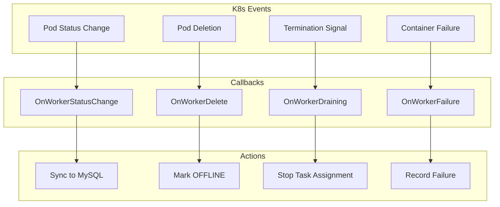

---

## Data Model

### Core Entities

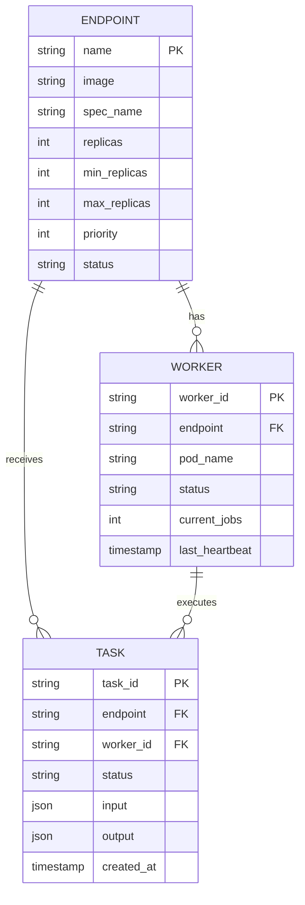

### Storage Strategy

| Data | Storage | Reason |
|------|---------|--------|
| Task Metadata | MySQL | Persistence, transactions, queries |
| Task Queue | Redis List | High-performance, atomic operations |
| Worker State | MySQL | Persistence, complex queries |
| Endpoint Config | MySQL | Persistent configuration |
| Distributed Lock | Redis | Multi-instance coordination |

---

## Task Flow

### Task Creation
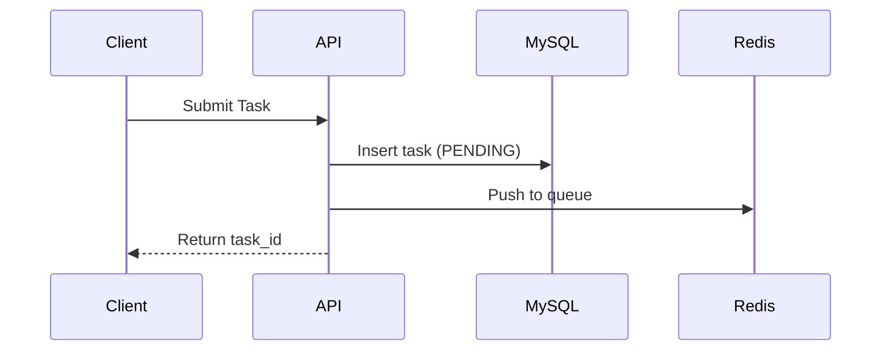

### Task Assignment (Double-Check Pattern)
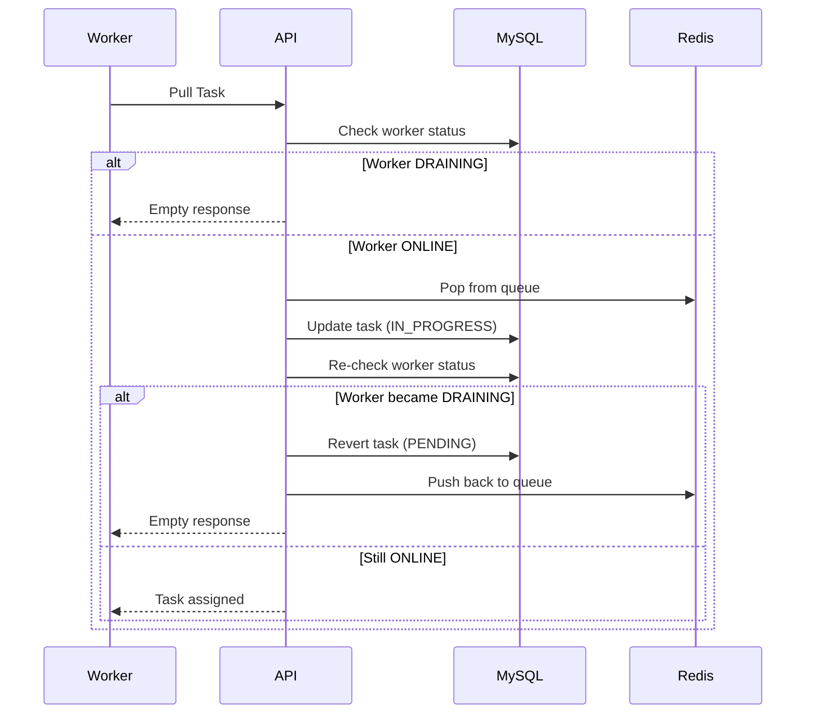

---

## Graceful Shutdown

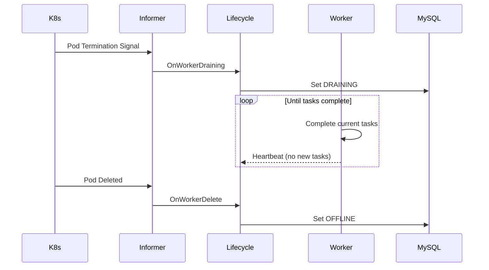

### Rolling Update Optimization

When deployment spec changes:
1. Detect deployment change via Informer
2. Set `PodDeletionCost = -1000` for idle workers (delete first)
3. Set `PodDeletionCost = 1000` for busy workers (delete last)
4. K8s respects deletion cost during rolling update

---

## Dashboard Statistics

### Pre-aggregated Statistics

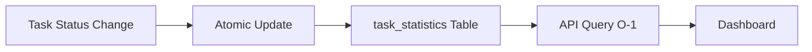

**Benefits**:
- Accurate: Based on complete dataset
- Fast: O(1) query time
- Scalable: Independent of task count
- Real-time: Incremental updates

### Statistics API

| Endpoint | Description |
|----------|-------------|
| `GET /api/v1/statistics/overview` | Global statistics |
| `GET /api/v1/statistics/endpoints` | Per-endpoint statistics |
| `POST /api/v1/statistics/refresh` | Manual refresh |

---

## Performance

### Throughput
- Task Creation: ~1000 tasks/s
- Task Assignment: ~950 pulls/s
- Heartbeat Processing: ~5000/s

### Latency
- Task Creation: <10ms (p99)
- Task Assignment: <50ms (p99)
- Autoscaling Decision: 30s interval

### Scalability
- Endpoints: 100+
- Workers: 1000+
- Concurrent Tasks: 10000+

---

## Deployment Architecture

### Single Replica
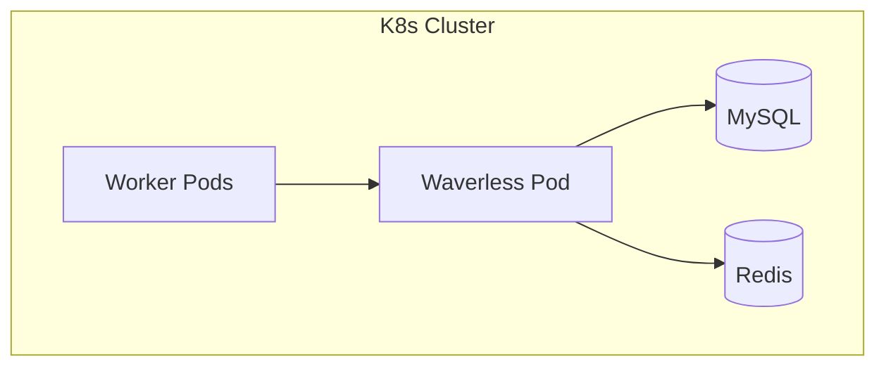

### High Availability
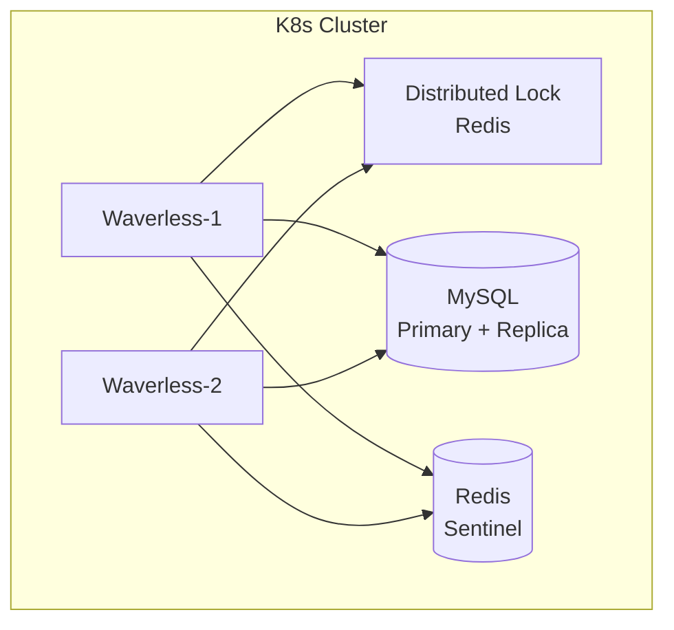

---

## Technology Stack

| Component | Technology | Purpose |
|-----------|------------|---------|
| Language | Go 1.21+ | Performance, K8s ecosystem |
| Web Framework | Gin | HTTP server |
| Database | MySQL 8.0+ | Persistent storage |
| Cache/Queue | Redis 7.0+ | Task queue, locking |
| K8s Client | client-go | Kubernetes integration |
| ORM | GORM | Database operations |
| Logging | Zap | Structured logging |

---

**Document Version**: v3.0  
**Last Updated**: 2026-02
