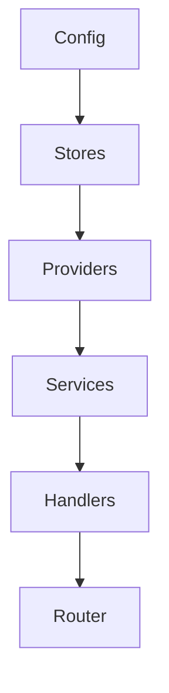
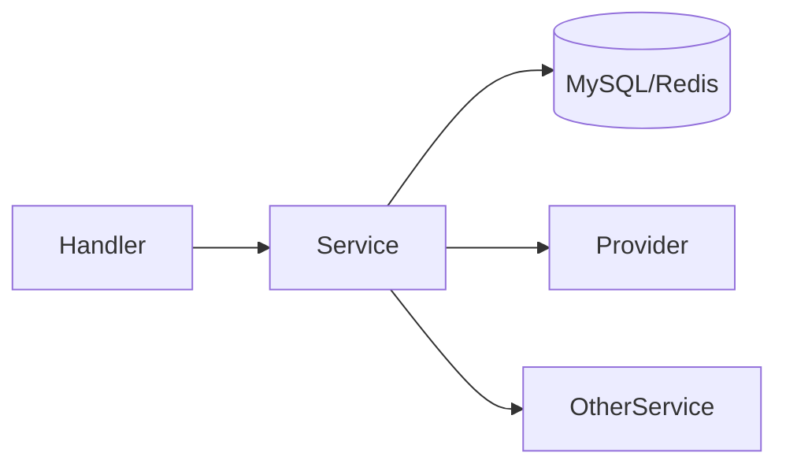
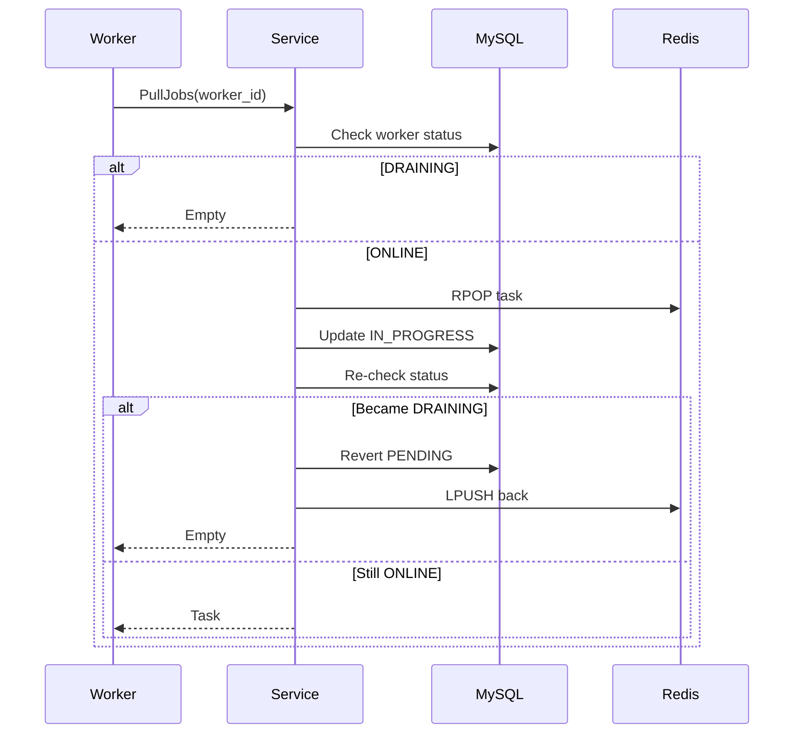
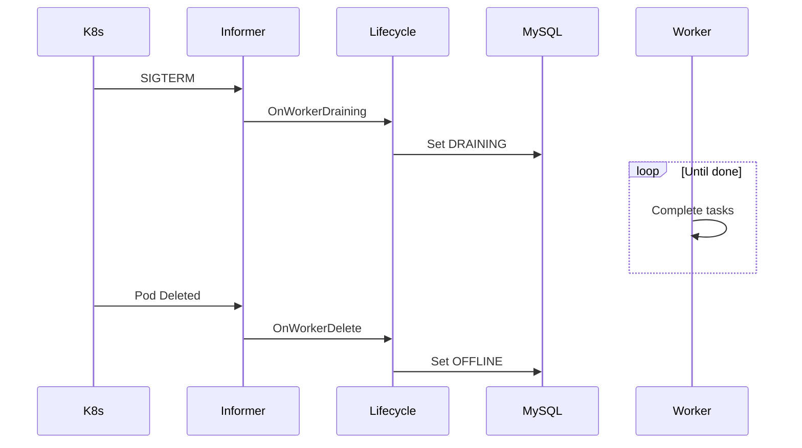
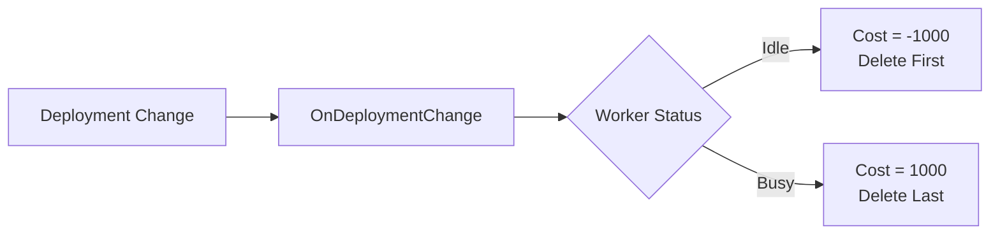
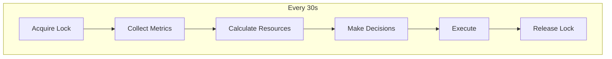
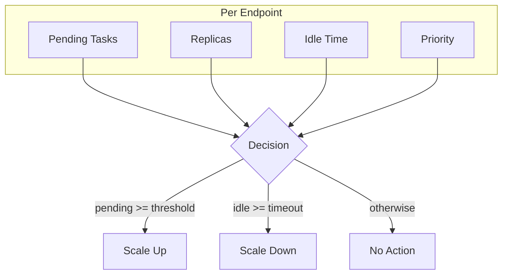
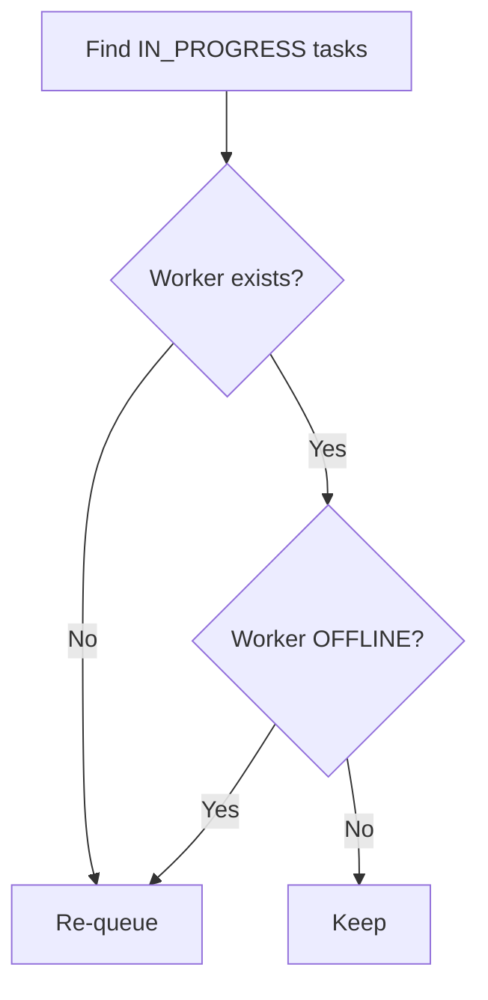

# Waverless Developer Guide

## Table of Contents

- [1. Code Structure](#1-code-structure)
- [2. Core Design Patterns](#2-core-design-patterns)
- [3. Task Assignment](#3-task-assignment)
- [4. Graceful Shutdown](#4-graceful-shutdown)
- [5. Autoscaler Design](#5-autoscaler-design)
- [6. Provider Integration](#6-provider-integration)
- [7. Background Jobs](#7-background-jobs)
- [8. Testing](#8-testing)

---

## 1. Code Structure

```
waverless/
├── app/                      # Application layer
│   ├── handler/             # HTTP handlers (thin)
│   ├── middleware/          # Auth, logging, recovery
│   └── router/              # Route definitions
│
├── cmd/                      # Entry points
│   ├── main.go             # Application entry
│   ├── initializers.go     # Dependency injection
│   └── jobs.go             # Background jobs
│
├── internal/                 # Internal packages
│   ├── service/            # Business logic
│   │   ├── endpoint/       # Endpoint CRUD + deployment
│   │   ├── lifecycle/      # Worker lifecycle
│   │   ├── task_service.go
│   │   └── worker_service.go
│   ├── model/              # Domain models
│   └── vo/                 # Value objects (DTOs)
│
├── pkg/                      # Shared packages
│   ├── autoscaler/         # Autoscaling engine
│   │   ├── manager.go      # Control loop
│   │   ├── decision_engine.go
│   │   ├── executor.go
│   │   └── metrics_collector.go
│   ├── provider/           # Deployment providers
│   │   ├── k8s/           # Kubernetes
│   │   ├── novita/        # Novita Serverless
│   │   └── docker/        # Docker (dev)
│   ├── interfaces/         # Shared interfaces
│   └── store/              # Data access
│       ├── mysql/         # MySQL repositories
│       └── redis/         # Redis operations
│
└── config/                   # Config files
```

### Layer Responsibilities

| Layer | Responsibility |
|-------|----------------|
| Handler | HTTP request/response, validation |
| Service | Business logic, orchestration |
| Provider | Infrastructure abstraction |
| Store | Data persistence |

---

## 2. Core Design Patterns

### Dependency Injection

All dependencies wired in `cmd/initializers.go`:



### Service Layer Pattern



### Transaction Pattern

Database operations that need atomicity are wrapped in transactions:
- Multiple operations execute as a single unit
- Automatic rollback on any failure
- Commit only when all operations succeed

### Async Non-Critical Updates

Non-critical operations (like statistics updates) run asynchronously to avoid blocking the main request flow.

---

## 3. Task Assignment

### Double-Check Pattern

Prevents race conditions when workers are draining:



### Atomic Task Selection

Task selection uses database-level locking to prevent race conditions:
- Select pending tasks with row-level lock
- Update status atomically
- Ensures no duplicate task assignment

---

## 4. Graceful Shutdown

### Flow



### Rolling Update Optimization

When deployment changes:



### Key Points

1. Informer detects pod termination signal
2. Worker marked DRAINING immediately
3. No new tasks assigned to DRAINING workers
4. Worker completes current tasks
5. Pod deleted after tasks complete
6. Worker marked OFFLINE

---

## 5. Autoscaler Design

### Control Loop



### Decision Engine



### Multi-Instance Safety

Uses Redis distributed lock to ensure only one instance makes scaling decisions at a time, preventing conflicting operations in multi-replica deployments.

### Priority & Preemption

1. Sort scale-up requests by priority
2. Minimum guarantee: 1 replica per endpoint with tasks
3. Remaining resources by priority
4. High priority can preempt low priority idle workers

### Starvation Protection

If endpoint waits > 5min without resources:
- Temporarily elevate priority
- Ensure eventual resource allocation

---

## 6. Provider Integration

### DeploymentProvider Interface

The provider interface defines standard operations:
- **Deploy**: Create new worker deployment
- **GetApp/ListApps**: Query deployment status
- **DeleteApp**: Remove deployment
- **ScaleApp**: Adjust replica count
- **UpdateDeployment**: Update deployment configuration
- **ListSpecs/GetSpec**: Query available resource specs
- **WatchReplicas**: Monitor replica changes
- **IsPodTerminating**: Check termination status

### Implementing New Provider

1. **Create package**: `pkg/provider/myprovider/`

2. **Implement the DeploymentProvider interface** with all required methods

3. **Implement lifecycle callbacks** (recommended):
   - OnWorkerStatusChange: Handle status transitions
   - OnWorkerDelete: Cleanup on worker removal
   - OnWorkerDraining: Stop task assignment
   - OnWorkerFailure: Record failure information
   - OnEndpointStatusChange: Track deployment health

4. **Register in provider factory**: Add initialization logic

5. **Register in lifecycle manager**: Connect lifecycle callbacks

### Provider Comparison

| Provider | Use Case | Lifecycle |
|----------|----------|-----------|
| K8s | Production | Full (Informers) |
| Novita | Serverless GPU | Full (Polling) |
| Docker | Development | Basic |

---

## 7. Background Jobs

### Job Manager (`cmd/jobs.go`)

| Job | Interval | Purpose |
|-----|----------|---------|
| CleanupOfflineWorkers | 30s | Mark stale workers offline |
| CleanupOrphanedTasks | 60s | Re-queue tasks from dead workers |
| CleanupTimedOutTasks | 60s | Fail tasks exceeding timeout |

### Orphaned Task Recovery



---

## 8. Testing

### Unit Tests

```bash
go test ./...
go test -cover ./...
go test ./pkg/autoscaler/...
```

### Integration Tests

```bash
go test -tags=integration ./...
```

### Property-Based Tests

Located in `*_property_test.go` files, these tests verify system behavior across randomly generated inputs to catch edge cases.

### Key Log Points

- Task submission events
- Job pull operations
- Worker draining notifications
- Scaling decisions

---

## Contributing

1. Fork repository
2. Create feature branch
3. Write tests
4. Submit pull request

### Code Style

- Follow Go conventions
- Use `gofmt` and `golint`
- Add comments for exported functions
- Meaningful commit messages

---

**Document Version**: v3.0  
**Last Updated**: 2026-02
