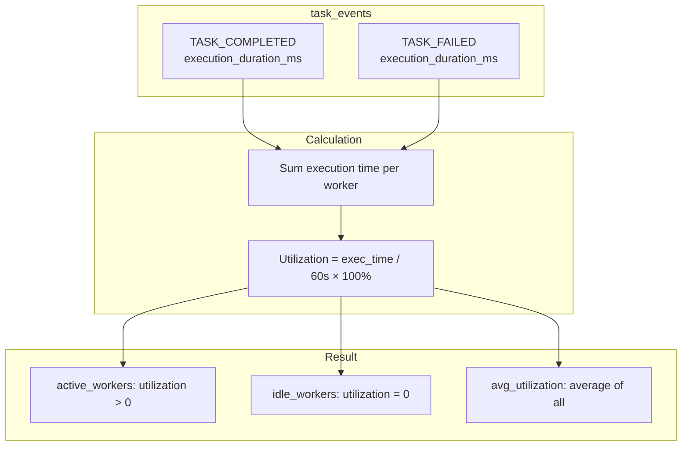
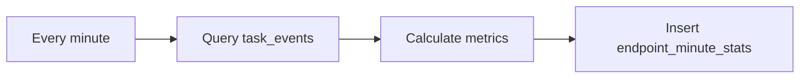

# Waverless Monitoring Design

This document describes the monitoring and statistics system design.

## Overview

Waverless provides comprehensive monitoring for tasks, workers, and resource utilization with minute-level aggregation.

```mermaid
flowchart LR
    subgraph "Data Sources"
        TE[task_events]
        W[workers]
    end

    subgraph "Aggregation"
        AGG[Minute Aggregator]
    end

    subgraph "Storage"
        EMS[endpoint_minute_stats]
    end

    subgraph "API"
        API[Monitoring API]
    end

    TE & W --> AGG
    AGG --> EMS
    EMS --> API
```

---

## Worker Utilization Calculation

### Design Principle

**Event-driven approach** - Calculate utilization from `task_events` rather than periodic snapshots.

### Why Not Snapshots?

Snapshot-based polling has sampling blind spots:

```
08:00:00 - Snapshot: Worker idle
08:00:05 - Task starts
08:00:15 - Task completes (10s execution)
08:00:20 - Worker idle
08:01:00 - Snapshot: Worker idle

Result: Statistics show worker always idle, missing 10s execution ❌
```

### Event-Driven Solution

Calculate from task completion events:



### Calculation Example

```
In one minute (60,000ms):

Worker A: 3 tasks, total 45,000ms
  Utilization = (45000 / 60000) × 100 = 75%

Worker B: 1 task, total 10,000ms
  Utilization = (10000 / 60000) × 100 = 16.67%

Worker C: No tasks
  Utilization = 0%

Results:
- active_workers = 2 (A, B)
- idle_workers = 1 (C)
- avg_utilization = (75 + 16.67 + 0) / 3 = 30.56%
```

### Benefits

| Approach | Pros | Cons | Adopted |
|----------|------|------|---------|
| Snapshot polling | Simple | Sampling blind spots | ❌ |
| Higher frequency | Better accuracy | DB load, still has gaps | ❌ |
| Event-driven | Precise, no blind spots | Needs heartbeat data | ✅ |

---

## Statistics Tables

### endpoint_minute_stats

Minute-level aggregated statistics per endpoint:

| Field | Description |
|-------|-------------|
| endpoint | Endpoint name |
| minute_start | Minute timestamp |
| tasks_submitted | Tasks submitted in this minute |
| tasks_completed | Tasks completed |
| tasks_failed | Tasks failed |
| active_workers | Workers with utilization > 0 |
| idle_workers | Workers with utilization = 0 |
| avg_worker_utilization | Average utilization % |
| avg_queue_time_ms | Average queue wait time |
| avg_execution_time_ms | Average execution time |

### task_events

Event log for task lifecycle:

| Field | Description |
|-------|-------------|
| task_id | Task identifier |
| endpoint | Endpoint name |
| event_type | TASK_CREATED, TASK_ASSIGNED, TASK_COMPLETED, etc. |
| event_time | Event timestamp |
| worker_id | Worker that processed the task |
| execution_duration_ms | Execution time in milliseconds |

---

## Aggregation Jobs

### Minute Aggregation

Runs every minute to aggregate statistics:



### Metrics Calculated

1. **Task metrics**: submitted, completed, failed counts
2. **Worker metrics**: active, idle counts, utilization
3. **Latency metrics**: queue time, execution time

---

## Monitoring API

### Get Endpoint Statistics

```bash
GET /api/v1/monitoring/endpoints/:name/stats
?from=2026-01-08T00:00:00Z
&to=2026-01-08T23:59:59Z
&granularity=minute  # minute, hour, day
```

### Response

```json
{
  "endpoint": "my-model",
  "stats": [
    {
      "timestamp": "2026-01-08T10:00:00Z",
      "tasks_submitted": 100,
      "tasks_completed": 95,
      "active_workers": 5,
      "idle_workers": 2,
      "avg_utilization": 68.5,
      "avg_execution_time_ms": 2500
    }
  ]
}
```

### Get Overview

```bash
GET /api/v1/monitoring/overview
```

Returns cluster-wide statistics summary.

---

## Edge Cases

### Tasks Spanning Minutes

Currently attributed to completion minute. Future optimization: split by execution time.

### Concurrent Tasks

Utilization can exceed 100% if worker supports concurrency - this accurately reflects reality.

### Worker Status Inconsistency

- Use heartbeat time range to ensure worker was online
- Combine with task_events for accuracy

---

## Best Practices

1. **Retention**: Keep minute stats for 7 days, aggregate to hourly/daily for longer retention
2. **Alerting**: Monitor for anomalies in utilization, queue time
3. **Dashboard**: Visualize trends over time per endpoint

---

**Document Version**: v2.0  
**Last Updated**: 2026-02
